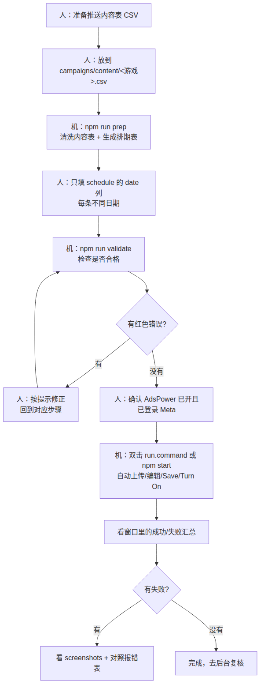
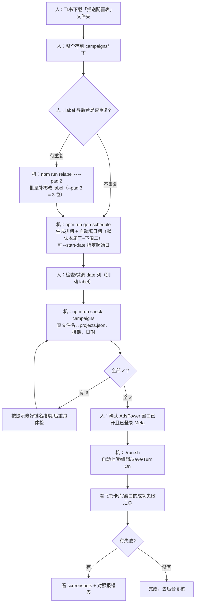

# 运营操作指南（Meta 游戏推送 · 半自动化）

> 面向运营的一页纸作业指引。技术细节见根目录 `README.md` 与 `campaigns/README.md`。
>
> **这是半自动化**：人负责「放文件、填日期、确认登录」；机器负责「生成排期、上传 CSV、逐条编辑、Save、Turn On」。

## 一、每次操作流程图



> 上图由 `docs/flow.mmd` 渲染。改流程时编辑 `flow.mmd` 后重新生成 PNG 即可
> （命令见文末「附：重新生成流程图」）。支持 Mermaid 的编辑器也可直接看下面源码：

<details>
<summary>Mermaid 源码</summary>



</details>

## 二、每次必做（5 步）

1. **放文件**：把飞书下载的「推送配置表」文件夹整个存到 `campaigns/` 下即可（里面是
   `推送配置表 - <游戏>.csv`，**无需改名/清洗**）。
2. **查 label 是否与后台重复**：
   - 不重复 → 直接下一步。
   - 有重复 → 执行 `npm run relabel -- --pad 2`（批量补零改 label，如 `AHA_1 → AHA_01`；
     `--pad 3` 则改成 `AHA_001`）。换一种位数即可让 label 整体变化，避开与后台已存在 label 的重复。
3. **生成排期**：`npm run gen-schedule`（自动生成排期表并填日期，**默认本周三 ~ 下周二**）。
   打开 `campaigns/schedule/<游戏>.schedule.csv` 看日期是否合适；需要指定起始日时用
   `npm run gen-schedule -- --start-date 2026-07-29`。如需手动微调，**只改 `date` 列、别动 `label`**。
   > 若报「内容表 CSV 格式异常 / Invalid Opening Quote」：先
   > `npm run fix-content-csv -- --dry-run` 预览，再 `npm run fix-content-csv` 写入，然后重跑本步。
4. **体检**：`npm run check-campaigns`（不开浏览器，几秒出结果）。检查内容表能否解析、文件名是否匹配
   `projects.json` 的键、排期/日期/同日冲突。**全部 ✓ 再往下**；出现 ✗ 按提示修好再重跑。
   > 若这轮推送表文件名与上轮完全一致、没改过，可跳过本步直接下一步（不过它只要几秒，建议每次都跑）。
5. **运行**：先确认 **AdsPower 浏览器窗口已打开**且已登录 Meta，然后执行 `./run.sh`（或 `npm start`）。

> `date` 由 `npm run gen-schedule` 自动填（默认本周三起连续排）；如需手动调整**只改 `date` 列**，
> **不要动 `label`**（`label` 由工具从内容表自动生成，改了会对不上）。排期表只有 `label,date` 两列
> （发送策略默认就是 `Predicted Best Time`，无需再填）。

## 三、日期怎么填（示例）

同一个 app **每天只能有 1 条**已开启的单发通知，所以每条必须用不同日期：

```csv
label,date
AHA_001,2026-07-30
AHA_002,2026-07-31
AHA_003,2026-08-01
```

- 留空的行会被跳过、不处理（可以先只填要发的几条）。
- 日期统一按 **UTC** 理解。

## 四、常见报错 → 原因 → 怎么办

| 报错 / 现象 | 原因 | 怎么办 |
|---|---|---|
| `Trying to create N notifications, and 0 are created` | 内容表 label 与后台已有的重复（同一 app 内 label 必须唯一） | 换新 label（和运营约定每轮 label 不重复），或先删掉后台同名条目 |
| `Invalid Opening Quote` /「内容表 CSV 格式异常」 | 飞书导出的内容表引号坏了（常见：`image_url` 末尾多一个 `"`） | `npm run fix-content-csv -- --dry-run` → 确认后 `npm run fix-content-csv` → 重跑 `gen-schedule` |
| `You cannot have more than 1 active Single Send notification scheduled in one day` | 多条填了同一天 | 每条改成**不同日期** |
| `You cannot have more than 10 active notification settings per app` | 该游戏已开启的通知达到 10 条上限 | 去后台把过期/多余的 **Turn Off 或删除**，分批发 |
| 运行报「排期条目的日期格式非法」 | `date` 列填错格式 | 用 `年-月-日`（如 `2026-07-30`）重新填 |
| 运行报「找不到某行 / 定位不到 label」 | 内容表换过、label 变了但排期表没更新 | 重新跑 `npm run gen-schedule` |
| 运行报「未找到上传入口 / 找不到某行」 | 页面结构变化 | 记下截图，找技术同学调 `src/selectors.ts` |

## 五、运行前检查清单

- [ ] AdsPower 客户端已启动
- [ ] 目标 profile 已登录 Meta 账号
- [ ] 飞书「推送配置表」文件夹已存到 `campaigns/` 下
- [ ] 已跑 `npm run gen-schedule` → 填好 `date`
- [ ] 每条推送日期都不同
- [ ] **已跑 `npm run check-campaigns` 且全部 ✓**（尤其确认每款都匹配到 appId，避免昨天那种「文件名对不上」整款失败）

## 六、调试用（技术同学）

### 参数总览（写在 `--` 之后）

| 参数 | 作用 | 典型场景 |
|---|---|---|
| `--game <名称>` | 只处理指定游戏（按项目名匹配，可重复传多个） | 单游戏调试；`--game "AHA" --game "PlotPlay"` |
| `--limit <N>` | 每个游戏最多处理前 N 条 | 冒烟测试用 `--limit 1` |
| `--dry-run` | 走完流程但**不 Save、不 Turn On**（用 Cancel 关编辑框） | 验证导航/选择器，不产生真实数据 |
| `--no-upload` | 跳过 Create from CSV 上传 | 后台已有数据，只改日期/开启，避免重复批量创建 |
| `--no-turn-on` | 本次只编辑保存、不 Turn On（覆盖 `.env` 的 `AUTO_TURN_ON`） | 想先 Save、稍后再统一开启 |
| `--use-open-page` | 不导航，直接接管当前已打开的标签页 | 手动开好某游戏页后，从 Create from CSV 开始 |
| `--clean-first` | 上传前先批量删除 Completed 通知腾出 active 名额（撞上限兜底仍保留） | 后台已攒了不少 Completed、想让整轮更快更稳；等价于 `.env` 的 `DELETE_COMPLETED_BEFORE_UPLOAD=true` |
| `-h` / `--help` | 查看帮助 | — |

> `--use-open-page` 无法切换项目，多游戏时只处理当前这一个；批量请用 `projects.json` 的固定 URL。

### 常用命令

```bash
# 0a) 可选：批量把 label 结尾数字补零（默认 2 位；--pad 3 补 3 位）
npm run relabel -- --dry-run          # 先预览要改什么
npm run relabel -- --pad 2            # 确认后写入
npm run relabel -- --pad 3 --game "AHA"

# 0a2) 内容表 CSV 引号坏了（Invalid Opening Quote）时先修
npm run fix-content-csv -- --dry-run  # 预览
npm run fix-content-csv               # 写入（只修已知安全模式）

# 0b) 日常准备：生成排期（默认本周三~下周二自动填日期；改过 label 后也要重跑）
npm run gen-schedule
npm run gen-schedule -- --start-date 2026-07-29  # 指定起始日
npm run gen-schedule -- --keep-dates             # 已排好日期时，改 label 后按行位次保留日期

# 0c) 开跑前体检（不开浏览器，几秒出结果；有问题退出码=1）
npm run check-campaigns

# 1) 冒烟：只跑 AHA 第 1 条，不改动任何数据（最安全的第一步）
npm start -- --game "AHA" --limit 1 --dry-run

# 2) 手动开好页面后，从当前页开始验证选择器（不导航）
npm start -- --use-open-page --limit 1 --dry-run

# 3) 后台已建过 CSV，只想改日期 + Turn On，不重复上传
npm start -- --game "AHA" --no-upload

# 4) 只编辑保存、先不开启（稍后再统一 Turn On）
npm start -- --game "AHA" --no-turn-on

# 5) 只编辑保存、且不重复上传（改期常用）
npm start -- --game "AHA" --no-upload --no-turn-on

# 6) 真实完整跑单个游戏（会 Save + Turn On）
npm start -- --game "AHA"

# 7) 真实跑多个指定游戏
npm start -- --game "AHA" --game "PlotPlay"

# 8) 正式全量（campaigns 下所有已填日期的游戏）
npm start
```

### 观察与排错小技巧

- 调大 `.env` 的 `SLOW_MO_MS`（如 `300`）能更清楚看每一步。
- 出错会在 `screenshots/` 存整页截图，按 `游戏_label` 命名，先看它定位问题。
- 页面结构变了导致找不到元素时，改 `src/selectors.ts` 里对应文本即可，业务逻辑不用动。
- `CLOSE_BROWSER_ON_EXIT=false`（默认）跑完不关浏览器，方便人工复核。

## 运行结果推送到飞书（可选）

配置后，每次跑完会自动把「本次汇总（成功/失败条数、失败明细、日志路径）」以彩色卡片
发到飞书群（全绿标题=全部成功，红色标题=有失败），不用一直盯着窗口。设置方法：

1. 在目标飞书群里「设置 → 群机器人 → 添加机器人 → 自定义机器人」，复制其 Webhook 地址。
2. 把地址填到 `.env` 的 `FEISHU_WEBHOOK_URL`。若机器人开了「签名校验」，把密钥填到 `FEISHU_SIGN_SECRET`。
3. 保存后正常 `./run.sh` 即可，跑完自动推送。

> 留空 `FEISHU_WEBHOOK_URL` 就完全不发通知；通知发送失败只会在日志里记一条告警，不影响主流程。

## 附：重新生成流程图

改了 `docs/flow.mmd` 后，用 mermaid-cli 重新导出 PNG（复用本机已装的 Playwright Chromium）：

```bash
PUPPETEER_SKIP_DOWNLOAD=true \
npx -y @mermaid-js/mermaid-cli -i docs/flow.mmd -o docs/运营流程图.png \
  -p docs/.puppeteer.json -b white -w 1500
```

> `docs/.puppeteer.json` 里的 `executablePath` 指向本机 Chromium，如换机器需相应调整。
