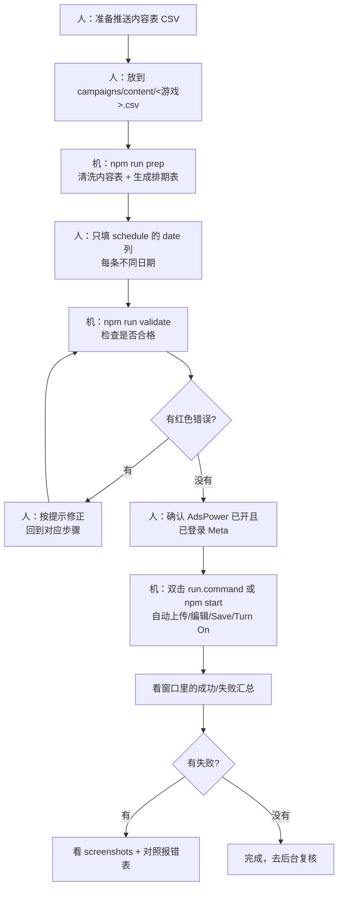

# 运营操作指南（Meta 游戏推送 · 半自动化）

> 面向运营的一页纸作业指引。技术细节见根目录 `README.md` 与 `campaigns/README.md`。
>
> **这是半自动化**：人负责「放文件、填日期、确认登录」；机器负责「清洗/生成排期、上传 CSV、逐条编辑、Save、Turn On」。

## 一、每次操作流程图


> 上图由 `docs/flow.mmd` 渲染。改流程时编辑 `flow.mmd` 后重新生成 PNG 即可
> （命令见文末「附：重新生成流程图」）。支持 Mermaid 的编辑器也可直接看下面源码：

<details>
<summary>Mermaid 源码</summary>



</details>

## 二、每次必做（4 步）

1. **放文件**：把内容表放到 `campaigns/content/<游戏>.csv`（文件名就是游戏名，如 `AHA.csv`）。
2. **一键准备**：`npm run prep`（= 清洗内容表 + 从 label 生成排期表）。
3. **填日期**：打开 `campaigns/schedule/<游戏>.schedule.csv`，**只改 `date` 列**，每条填**不同日期**
   （格式 `年-月-日`，如 `2026-07-30`，按 UTC）。然后 `npm run validate`，直到没有红色 ✖。
4. **运行**：确认 AdsPower 客户端已开、profile 已登录 Meta，然后双击 `run.command`（或 `npm start`）。

> 只填 `date`，**不要动 `label` 和 `send_time_strategy`**。`label` 由工具从内容表自动生成，改了会对不上。

## 三、日期怎么填（示例）

同一个 app **每天只能有 1 条**已开启的单发通知，所以每条必须用不同日期：

```csv
label,date,send_time_strategy
AHA_001,2026-07-30,Predicted Best Time
AHA_002,2026-07-31,Predicted Best Time
AHA_003,2026-08-01,Predicted Best Time
```

- 留空的行会被跳过、不处理（可以先只填要发的几条）。
- 日期统一按 **UTC** 理解。

## 四、常见报错 → 原因 → 怎么办

| 报错 / 现象 | 原因 | 怎么办 |
|---|---|---|
| `Trying to create N notifications, and 0 are created` | 内容表 label 与后台已有的重复，或列格式不对 | 换新 label，或删掉后台同名条目；先跑 `npm run prep` + `validate` |
| `You cannot have more than 1 active Single Send notification scheduled in one day` | 多条填了同一天 | 每条改成**不同日期** |
| `You cannot have more than 10 active notification settings per app` | 该游戏已开启的通知达到 10 条上限 | 去后台把过期/多余的 **Turn Off 或删除**，分批发 |
| `validate` 报「排期表里的 label 在内容表中找不到」 | 内容表换过、label 变了但排期表没更新 | 重新跑 `npm run prep`（或单独 `npm run gen-schedule`） |
| 运行报「未找到上传入口 / 找不到某行」 | 页面结构变化 | 记下截图，找技术同学调 `src/selectors.ts` |

## 五、运行前检查清单

- [ ] AdsPower 客户端已启动
- [ ] 目标 profile 已登录 Meta 账号
- [ ] 内容表已放进 `campaigns/content/`
- [ ] 已跑 `npm run prep` → 填好 `date` → `npm run validate` 通过
- [ ] 每条推送日期都不同

## 六、调试用（技术同学）

### 参数总览（写在 `--` 之后）

| 参数 | 作用 | 典型场景 |
|---|---|---|
| `--game <名称>` | 只处理指定游戏（按项目名匹配，可重复传多个） | 单游戏调试；`--game "AHA" --game "PlotPlay"` |
| `--limit <N>` | 每个游戏最多处理前 N 条 | 冒烟测试用 `--limit 1` |
| `--dry-run` | 走完流程但**不 Save、不 Turn On**（用 Cancel 关编辑框） | 验证导航/选择器，不产生真实数据 |
| `--no-upload` | 跳过 Create from CSV 上传 | 后台已有数据，只改日期/开启，避免重复批量创建 |
| `--no-turn-on` | 本次只编辑保存、不 Turn On（覆盖 `.env` 的 `AUTO_TURN_ON`） | 想先 Save、稍后再统一开启 |
| `--use-open-page` | 不导航，直接接管当前已打开的标签页 | 手动开好某游戏页后，从 Create from CSV 开始 |
| `--validate-only` | 只校验内容表/排期，不启动浏览器 | 等同 `npm run validate` |
| `-h` / `--help` | 查看帮助 | — |

> `--use-open-page` 无法切换项目，多游戏时只处理当前这一个；批量请用 `projects.json` 的固定 URL。

### 常用命令

```bash
# 0) 日常准备：清洗 + 生成排期（填日期前）
npm run prep

# 1) 冒烟：只跑 AHA 第 1 条，不改动任何数据（最安全的第一步）
npm start -- --game "AHA" --limit 1 --dry-run

# 2) 手动开好页面后，从当前页开始验证选择器（不导航）
npm start -- --use-open-page --limit 1 --dry-run

# 3) 后台已建过 CSV，只想改日期 + Turn On，不重复上传
npm start -- --game "AHA" --no-upload

# 4) 只编辑保存、先不开启（稍后再统一 Turn On）
npm start -- --game "AHA" --no-turn-on

# 5) 只编辑保存、且不重复上传（改期常用）
npm start -- --game "AHA" --no-upload --no-turn-on

# 6) 真实完整跑单个游戏（会 Save + Turn On）
npm start -- --game "AHA"

# 7) 真实跑多个指定游戏
npm start -- --game "AHA" --game "PlotPlay"

# 8) 只做数据自检，不开浏览器
npm run validate            # 等价 npm start -- --validate-only
npm run validate -- --game "AHA"

# 9) 正式全量（campaigns 下所有已填日期的游戏）
npm start
```

### 观察与排错小技巧

- 调大 `.env` 的 `SLOW_MO_MS`（如 `300`）能更清楚看每一步。
- 出错会在 `screenshots/` 存整页截图，按 `游戏_label` 命名，先看它定位问题。
- 页面结构变了导致找不到元素时，改 `src/selectors.ts` 里对应文本即可，业务逻辑不用动。
- `CLOSE_BROWSER_ON_EXIT=false`（默认）跑完不关浏览器，方便人工复核。

## 附：重新生成流程图

改了 `docs/flow.mmd` 后，用 mermaid-cli 重新导出 PNG（复用本机已装的 Playwright Chromium）：

```bash
PUPPETEER_SKIP_DOWNLOAD=true \
npx -y @mermaid-js/mermaid-cli -i docs/flow.mmd -o docs/运营流程图.png \
  -p docs/.puppeteer.json -b white -w 1500
```

> `docs/.puppeteer.json` 里的 `executablePath` 指向本机 Chromium，如换机器需相应调整。
